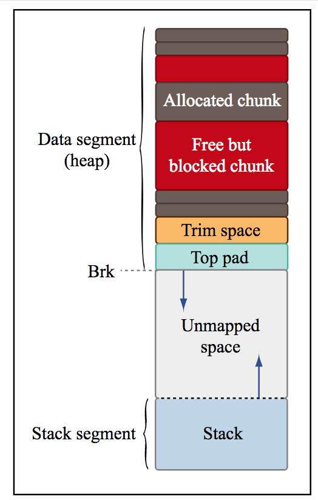

# learnc
learning c and cpp  

//====================================== 
**Managing memory**   
//====================================== 
- Conceptually 
  - Keep track of what memory belongs to your program, making sure:
    - all addresses you give to other functions are valid for those functions and 
    - you deallocate memory you are not using while you still know about it.
- While programming 
  - Use malloc to allocate memory on the heap if you will need it after the current function returns. 
  - Use free to free pointers before you reassign them and lose the pointer.
- Dynamic allocation and deallocation
  - Allocation: malloc is a C standard library function that finds a chunk of free memory of the desired size and returns a pointer to it.
  - Deallocation: free marks the memory associated with a specific address as no longer in use. (It keeps track of how much memory was associated with that address!)
- How you can produce memory errors
  - Program accesses memory it shouldn’t (not yet allocated, not yet freed, past end of heap block, inaccessible parts of the stack). 
  - Dangerous use of unitialized values. 
  - Memory leaks. 
  - Bad frees. 
- Manifestations of memory errors
  - “Junk” values. 
  - Segmentation fault–program crashes. 
- when to use pointers 
  - When you have to allocate memory on heap. 
  - When passing a parameter whose value you want to allow the other function to change. 
  - Also for efficiency–to avoid copying data structures.
  
//====================================== 
**stack vs. heap.**  
//====================================== 
- The C compiler lays out memory corresponding to functions (arguments, variables) on the stack. 
- C allows the programmer to allocate additional memory on the heap. 

SIG name      | **Stack**       | **Heap**
------------- |-------------| ------
Memory is allocated  |Upon entering function|With malloc 
Memory is deallocated |Upon function return |With free
Addresses are assigned|Statically|Dynamically

 
//====================================== 
Using valgrind to detect memory leaks.  
//====================================== 
- A simple tutorial: http://cs.ecs.baylor.edu/~donahoo/tools/valgrind/    
- valgrind program provides several performance tools:    
including memcheck:    
valgrind --tool=memcheck --leak-check=yes program.o   
- memcheck runs program using virtual machine and tracks memory leaks     
- Does not trigger on out-of-bounds index errors for arrays on the stack   
- Can use to profile code to measure memory usage, identify execution bottlenecks  
- valgrind tools (use name in -tool= flag):  
   - cachegrind – counts cache misses for each line of code  
   - callgrind – counts function calls and costs in program  
   - massif – tracks overall heap usage   
   
//======================================  
Using malloc()  
//======================================  
Minimize overhead – use fewer, larger allocations  
• Minimize fragmentation – reuse memory allocations as much as possible  
• Growing memory – using realloc() can reduce fragmentation  
• Repeated allocation and freeing of variables can lead to poor performance from unnecessary splitting/coalescing  
(depending on implementation of malloc())   

• Mapping memory: mmap(), munmap(). Useful for demand paging.  
• Resizing heap: sbrk()  
• Designing malloc()  
• implicit linked list,explicit linked list  
• best fit,first fit,next fit  

• Problems: 
   • fragmentation 
   • memory leaks 
   • valgrind –tool=memcheck, checks for memory leaks. 

//======================================  
malloc() for the real world  
//======================================  
• Used in GNU libc version of malloc()  
• Details have changed, but nice general discussion can be found at  
http://g.oswego.edu/dl/html/malloc.html  
• Chunks implemented as in segregated free list, with pointers to previous/next chunks in free list in payload of free blocks  
• Lists segregated into bins according to size; bin sizes spaced logarithmically  
• Placement done in best-fit order  
• Deferred coalescing and splitting performed to minimize overhead   

//======================================  
When is memory unreferenced?  
//======================================  
• Pointer(s) to memory no longer exist  
• Tricky when pointers on heap or references are circular  
(think of circular linked lists)
• Pointers can be masked as data in memory; garbage collector may free data that is still referenced (or not free unreferenced data)   

//======================================  
A closer look at the GCC compilation process  
//======================================  
- Preprocessor:
  - Translation of # directives. 
    - Translates all macros (#DEFINE’s) into inline C code. 
    - Takes #include files and inserts them into the code. 
      - Get redefinition error if structs etc. are defined more than once! 
      - Use #ifndef directive to define things only if they have not been defined.
- Parsing and translation
  - Translates to assembly, performing optimizations.
- Assembler 
  - Translates assembly to machine instructions. 
- Linking 
  - Static. For each function called by the program, the assembly to that function is included directly in the executable, allowing function calls to directly address code. 
  - Dynamic. Function calls call a Procedure Linkage Table, which contains the proper addresses of the mapped memory.

//======================================  
A garbage collector for C and C++  
//======================================  
http://www.hboehm.info/gc/
  
 
   
 //======================================  
 Parallel computing  
 //======================================  
- Parallelism: Multiple computations are done simultaneously.  
  - Instruction level (pipelining)  
  - Data parallelism (SIMD)  
  - Task parallelism (embarrassingly parallel)   
- Concurrency: Multiple computations that may be done in parallel.   
- Concurrency vs. Parallelism  
http://tutorials.jenkov.com/java-concurrency/concurrency-vs-parallelism.html    
  

//======================================  
Process vs. Threads  
//======================================  
- Process:   
An instance of a program that is being executed in its own address space. In POSIX systems, each process maintains its own heap, stack, registers, file descriptors etc.  
Communication:  
  - Shared memory  
  - Network  
  - Pipes, Queues  
- Thread:   
A light weight process that shares its address space with others.In POSIX systems, each thread maintains the bare essentials: registers, stack, signals.   
- Communication:  
shared address space.   

 
  
  
//======================================  
Multithreaded:   
 //======================================  
- Program is organized as multiple and concurrent threads of execution.
- The main thread spawns multiple threads.
- The thread may communicate with one another.
- Advantages:
  - Improves performance
  - Improves responsiveness
  - Improves utilization
  - less overhead compared to multiple processes 
   
  
- Even in C, multithread programming may be accomplished in several ways:    
  - Pthreads: POSIX C library.    
  - OpenMP    
  - Intel threading building blocks    
  - Cilk (from CSAIL!)    
  - Grand central despatch    
  - **CUDA (GPU)**    
  - **OpenCL (GPU/CPU)**     
  
- Thread: abstraction of parallel processing with shared memory
  - Program organized to execute multiple threads in parallel
  - Threads spawned by main thread, communicate via shared resources and joining
  - pthread library implements multithreading
    - int pthread_create ( pthread_t ∗ thread , const p t h r e a d _ a t tr _ t ∗ a t tr , void ∗(∗ s t a rt _ r o u t i n e ) ( void ∗) , void ∗ arg ) ;
    - void pthread_exit(void ∗value_ptr);
    - int pthread_join(pthread_t thread, void ∗∗value_ptr);
    - pthread_t pthread_self(void); 
- Resource sharing
  - Access to shared resources need to be controlled to ensure deterministic operation
  - Synchronization objects: mutexes, semaphores, read/write locks, barriers
  - Mutex: simple single lock/unlock mechanism
    - int pthread_mutex_init(pthread_mutex_t ∗mutex, const pthread_mutexattr_t ∗ attr);
    - int pthread_mutex_destroy(pthread_mutex_t ∗mutex);
    - int pthread_mutex_lock(pthread_mutex_t ∗mutex);
    - int pthread_mutex_trylock(pthread_mutex_t ∗mutex);
    - int pthread_mutex_unlock(pthread_mutex_t ∗mutex); 
- Condition variables
  - Lock/unlock (with mutex) based on run-time condition variable
  - Allows thread to wait for condition to be true
  - Other thread signals waiting thread(s), unblocking them
    - int pthread_cond_init(pthread_cond_t ∗cond, const pthread_condattr_t ∗attr);
    - int pthread_cond_destroy(pthread_cond_t ∗cond);
    - int pthread_cond_wait(pthread_cond_t ∗cond, pthread_mutex_t ∗mutex);
    - int pthread_cond_broadcast(pthread_cond_t ∗cond);
    - int pthread_cond_signal(pthread_cond_t ∗cond); 
- OS implements scheduler – determines which threads execute when. Scheduling may execute threads in arbitrary order. Without proper synchronization, code can execute non-deterministically. Non-determinism creates a race condition – where the
behavior/result depends on the order of executio.
- Race conditions:
Race conditions occur when multiple threads share a variable, without proper synchronization
  - Synchronization uses special variables, like a mutex, to ensure order of execution is correct
  - Example: thread T1 needs to do something before thread T2
    - condition variable forces thread T2 to wait for thread T1
    - producer-consumer model program 
  - Example: two threads both need to access a variable and modify it based on its value
    - surround access and modification with a mutex
    - mutex groups operations together to make them atomic treated as one unit 
- To make your code thread-safe:
  - Use synchronization objects around shared variables
  - Use reentrant functions
  - Use synchronization around functions returning pointers to shared memory (lock-and-copy):
    - lock mutex for function
    - call unsafe function
    - dynamically allocate memory for result; (deep) copy result into new memory
    - unlock mutex 
    
- Deadlock: 
  - Deadlock – happens when every thread is waiting on another thread to unblock
  - Usually caused by improper ordering of synchronization objects
  - Tricky bug to locate and reproduce, since schedule-dependent
  - Can visualize using a progress graph – traces progress of threads in terms of synchronization objects
  
- Starvation and priority inversion
  - Starvation similar to deadlock
  - Scheduler never allocates resources (e.g. CPU time) for a thread to complete its task
  - Happens during priority inversion
  - example: highest priority thread T1 waiting for low priority thread T2 to finish using a resource, while thread T3, which has higher priority than T2, is allowed to run indefinitely. thread T1 is considered to be in starvation 
  
    
//======================================  
**Sockets**   
//======================================  
- Socket: abstraction to enable communication across a network in a manner similar to file I/O
- Uses header <sys/socket.h> (extension of C standard library)
- Network I/O, due to latency, usually implemented asynchronously, using multithreading
- Sockets use client/server model of establishing connections 
 
 
-  Creating a socket
  - Create a socket, getting the file descriptor for that socket:
  int socket(int domain, int type, int protocol );
    - domain – use constant AF_INET, so we’re using the internet; might also use AF_INET6 for IPv6 addresses
    - type – use constant SOCK_STREAM for connection-based protocols like TCP/IP; use SOCK_DGRAM for connectionless datagram protocols like UDP (we’ll concentrate on the
former)
    - protocol – specify 0 to use default protocol for the socket type (e.g. TCP)
    - returns nonnegative integer for file descriptor, or −1 if couldn’t create socket
  - Don’t forget to close the file descriptor when you’re done! 
  
  
- Connecting to a server
  - Using created socket, we connect to server using:    
  int connect(int fd, struct sockaddr ∗addr, int addr_len);
    - fd: the socket’s file descriptor
    - addr: the address and port of the server to connect to; for internet addresses, cast data of type struct
sockaddr_in, which has the following members:
      - sin_family – address family; always AF_INET
      - sin_port – port in network byte order (use htons() to convert to network byte order)
      - sin_addr.s_addr – IP address in network byte order (use htonl() to convert to network byte order)
    - addr_len – size of sockaddr_in structure
    - returns 0 if successful
- Associate server socket with a port
  - Using created socket, we bind to the port using:   
  int bind(int fd, struct sockaddr ∗addr, int addr_len);
    - fd, addr, addr_len – same as for connect()
    - note that address should be IP address of desired interface (e.g. eth0) on local machine
    - ensure that port for server is not taken (or you may get “address already in use” errors)
    - return 0 if socket successfully bound to port 
    
- Listening for clients
  - Using the bound socket, start listening:  
  int listen (int fd, int backlog);
    - fd – bound socket file descriptor
    - backlog – length of queue for pending TCP/IP connections; normally set to a large number, like 1024
    - returns 0 if successful 
- Accepting a client’s connection
  - Wait for a client’s connection request (may already be queued):   
  int accept(int fd, struct sockaddr ∗addr, int ∗addr_len);
    - fd – socket’s file descriptor
    - addr – pointer to structure to be filled with client address info (can be NULL)
    - addr_len – pointer to int that specifies length of structure pointed to by addr; on output, specifies the length of the stored address (stored address may be truncated if bigger than supplied structure)
    - returns (nonnegative) file descriptor for connected client socket if successful 
- Reading and writing with sockets
  - Send data using the following functions:   
  int write(int fd, const void ∗buf, size_t len );     
  int send(int fd, const void ∗buf, size_t len, int flags );      
  - Receive data using the following functions:  
  int read(int fd, void ∗buf, size_t len );  
  int recv(int fd, void ∗buf, size_t len, int flags );  
    - fd – socket’s file descriptor
    - buf – buffer of data to read or write
    - len – length of buffer in bytes
    - flags – special flags; we’ll just use 0
  - all these return the number of bytes read/written (if successful) 
    
- Asynchronous I/O
  - Up to now, all I/O has been synchronous – functions do not return until operation has been performed
  - Multithreading allows us to read/write a file or socket without blocking our main program code (just put I/O functions in a separate thread)
  - Multiplexed I/O – use select() or poll() with multiple file descriptors
  
- I/O multiplexing with select()
  - To check if multiple files/sockets have data to read/write/etc: (include <sys/select.h>)
  int select(int nfds, fd_set ∗readfds, fd_set ∗writefds, fd_set ∗errorfds, struct timeval ∗timeout);
    - nfds – specifies the total range of file descriptors to be tested (0 up to nfds−1)
    - readfds, writefds, errorfds – if not NULL, pointer to set of file descriptors to be tested for being ready to read, write, or having an error; on output, set will contain a list of only those file descriptors that are ready
    - timeout – if no file descriptors are ready immediately, maximum time to wait for a file descriptor to be ready
    - returns the total number of set file descriptor bits in all the sets
  - Note that select() is a blocking function 
  - fd_set – a mask for file descriptors; bits are set (“1”) if in the set, or unset (“0”) otherwise Use the following functions to set up the structure:
    - FD_ZERO(&fdset) – initialize the set to have bits unset for all file descriptors
    - FD_SET(fd, &fdset) – set the bit for file descriptor fd in the set
    - FD_CLR(fd, &fdset) – clear the bit for file descriptor fd in the set
    - FD_ISSET(fd, &fdset) – returns nonzero if bit for file descriptor fd is set in the set 

- I/O multiplexing using poll()
  - Similar to select(), but specifies file descriptors differently: (include <poll.h>) 
  int poll (struct pollfd fds [], nfds_t nfds, int timeout);
    - fds – an array of pollfd structures, whose members fd, events, and revents, are the file descriptor, events to
check (OR-ed combination of flags like POLLIN, POLLOUT, POLLERR, POLLHUP), and result of polling with that file descriptor for those events, respectively
    - nfds – number of structures in the array
    - timeout – number of milliseconds to wait; use 0 to return immediately, or −1 to block indefinitely 
    
- Summary:
  - multithreading:
    - Race conditions
      - non-determinism in thread order.
      - can be prevented by synchronization
      - atomic operations necessary for synchronization
    - Mutex: Allows a single thread to own it
    - Semaphores: Generalization of mutex, allows N threads to acquire it at a time.
      - P(s) : acquires a lock
      - V(s) : releases lock
      - sem_init(),sem_destroy()
      - sem_wait(),sem_trywait(),sem_post()
    - Other problems: deadlock, starvation 
  - Sockets: 
    - <sys/socket.h>
    - enables client-server computing
    - Client: connect()
    - Server: bind(),listen(),accept()
    - I/O: write(),send(),read(),recv()
  
   
  
  
  
//======================================  
- Inter process communication
  - Signals
  - Fork
  - Pipes
  - FIFO  
//======================================  
- Each process has its own address space. Therefore, individual processes cannot communicate unlike threads.
- Interprocess communication: Linux/Unix provides several ways to allow communications
  - signal
  - pipes
  - FIFO queues
  - shared memory
  - semaphores
  - sockets
- signal
  - void (*signal(int sig,void(*handler)(int )))( int)   
  
SIG name      | explain       | comment
------------- |-------------| ------
SIGABRT |abnormal termination | 
SIGFPE |floating point error | 
SIGILL|illegal instruction  | 
SIGINT | interrupt||
SIGSEGV | segmentation fault |
SIGTERM|termination request |
SIGBUS|bus error|
SIGQUIT| quit|
    The two signals SIGSTOP,SIGKILL cannot be handled.
  - int raise( int sig)   
  can be used to send signal sig to the program. 
    - Notes:
      - There can be race conditions.
      - signal handler itself can be interrupted.
      - use of non-reentrant functions unsafe.
      - sigprocmask can be used to prevent interruptions.
      - handler is reset each time it is called.
- Fork
  -  pid_t fork (void) 
    - fork() is a system call to create a new process
    - In the child process, it returns 0
    - In the parent process, it returns the PID (process id) of the child.
    - The child PID can be used to send signals to the child process.
    - returns -1 on failure (invalid PID) 
   
  
  
 //======================================  
 **Standard Template Library**
 - Architecture
   - Algorithms
   - Iterators
   - Containers
     - Sequence containers
       - Array
       - Vector
       - List
       - Forward List
       - Deque
     - Associative containers
       - Set
       - Map
       - Multiset
       - MultimapSet
       - Unordered set
       - Unordered multiset
       - Unordered map
       - Unordered multimap
     - Container adapters
       - Stack
       - Queue
       - Priority Queue
       
   - Functors
  
 //======================================  
 
- Associative containers  
  Associative containers store data in a sorted fashion.the order in which the data is inserted will not be retained by the associative containers. Associative containers are highly efficient in searching a value with O( log n ) runtime complexity. Every time a new value gets added to the container, the container will reorder the values stored internally if required.  
 
 Associative containers organize the data as key-value pairs. The data will be sorted based on the key for random and faster access. Associative containers come in two flavors:
  - Ordered 
  - Unordered. 
    The following associative containers come under ordered containers, as they are ordered/sorted in a particular fashion. Ordered associative containers generally use some form of Binary Search Tree (BST); usually, a red-black tree is used to store the data:
  - Set
    - Set allows only unique values to be stored.
    - in a sorted fashion
    - set organizes the values using the value itself as a key.
    - The set container is immutable, that is, the values stored in a set can't be modified;
    - the values can be deleted
    - A set generally uses a red-black tree data structure, which is a form of balanced BST
    - The time complexity of set operations are guaranteed to be O(log N). 
  - Map
  - Multiset
    - multiset lets you store duplicate values. 
    - the values themselves are used as keys to organize the data. 
    - A multiset container is just like a set; it doesn't allow modifying the values stored in the multiset.
  - Multimap
    - A multimap works exactly as a map, except that a multimap container will allow multiple values to be stored with the same key.
    The following associative containers come under unordered containers, as they are not ordered in any particular fashion and they use hash tables:
  - Unordered Set
    - An unordered set works in a manner similar to a set, except that the internal behavior of these containers differs. 
    - A set makes use of red-black trees while an unordered set makes use of hash tables. 
    - The time complexity of set operations is O(log N) while the time complexity of unordered set operations is O(1);
    hence, the unordered set tends to be faster than the set.
    - The values stored in an unordered set are not organized in any particular fashion, unlike in a set, which stores values in a sorted fashion. 
    - If performance is the criteria, then an unordered set is a good bet; however, if iterating the values in a sorted fashion is a requirement, then set is a good choice.
  - Unordered Map
    - An unordered map works in a manner similar to a map, except that the internal behavior of these containers differs. 
    - A map makes use of red-black trees while unordered map makes use of hash tables. 
    - The time complexity of map operations is O(log N) while that of unordered map operations is O(1); 
    hence, an unordered map tends to be faster than a map.
    - The values stored in an unordered map are not organized in any particular fashion, unlike in a map where values are sorted by keys.
  - Unordered Multiset
    - An unordered multiset works in a manner similar to a multiset, except that the internal behavior of these containers differs. 
    - A multiset makes use of red-black trees while an unordered multiset makes use of hash tables. 
    - The time complexity of multiset operations is O(log N) while that of unordered multiset operations is O(1). 
    Hence, an unordered multiset tends to be faster than a multiset.
    - The values stored in an unordered multiset are not organized in any particular fashion, unlike in a multiset where values are stored in a sorted fashion. 
    - If performance is the criteria, unordered multisets are a good bet; however, if iterating the values in a sorted fashion is a requirement, then multiset is a good choice.
  - Unordered Multimap
    - An unordered multimap works in a manner similar to a multimap, except that the internal behavior of these containers differs. 
    - A multimap makes use of red-black trees while an unordered multimap makes use of hash tables. 
    - The time complexity of multimap operations is O( log N) while that of unordered multimap operations is O(1); 
    hence, an unordered multimap tends to be faster than a multimap.
    - The values stored in an unordered multimap are not organized in any particular fashion, unlike in multimaps where values are sorted by keys. 
    - If performance is the criteria, then an unordered multimap is a good bet; however, if iterating the values in a sorted fashion is a requirement, then multimap is a good choice.
    
- Container adapters  
Container adapters adapt existing containers to provide new containers. In simple terms, STL extension is done with composition instead of inheritance.  
STL containers can't be extended by inheritance, as their constructors aren't virtual. 
Throughout the STL, you can observe that while static polymorphism is used both in terms of operator overloading and templates, dynamic polymorphism is consciously avoided for performance reasons. 
Hence, extending the STL by subclassing the existing containers isn't a good idea, as it would lead to memory leaks because container classes aren't designed to behave like base classes.  
The STL supports the following container adapters:  
  - Stack
    - Stack is not a new container; it is a template adapter class. 
    - The adapter containers wrap an existing container and provide high-level functionalities. 
    - The stack adapter container offers stack operations while hiding the unnecessary functionalities that are irrelevant for a stack. 
    - The STL stack makes use of a deque container by default; however, we can instruct the stack to use any existing container that meets the requirement of the stack during the stack instantiation.
    - Deques, lists, and vectors meet the requirements of a stack adapter.
    - A stack operates on the Last In First Out (LIFO) philosophy. 
  - Queue
    - A queue works based on the First In First Out (FIFO) principle. 
    - A queue is not a new container; it is a templatized adapter class that wraps an existing container and provides the high-level functionalities that are required for queue operations, while hiding the unnecessary functionalities that are irrelevant for a queue. 
    - The STL queue makes use of a deque container by default; however, we can instruct the queue to use any existing container that meets the requirement of the queue during the queue instantiation.
    - In a queue, new values can be added at the back and removed from the front. Deques, lists, and vectors meet the requirements of a queue adapter.
  - Priority Queue
    - A priority queue is not a new container; it is a templatized adapter class that wraps an existing container and provides high-level functionalities that are required for priority queue operations, while hiding the unnecessary functionalities that are irrelevant for a priority queue. 
    - A priority queue makes use of a vector container by default; however, a deque container also meets the requirement of the priority queue. Hence, during the priority queue instantiation, you could instruct the priority queue to make use of a deque as well. 
    - A priority queue organizes the data in such a way that the highest priority value appears first; in other words, the values are sorted in a descending order.
    - priority_queue is a special type of queue that reorders the inputs in such a way that the highest value appears first.

The deque and vector meet the requirements of a priority queue adaptor.
 
 
 
  
  //======================================  
**Template Programming**
- Generic programming
- Function templates
- Class templates
- Overloading function templates
- Generic classes
- Explicit class specializations
- Partial specializations
  //======================================  
 
- Generic programming.
  - Generic programming is a style of programming that helps you develop **reusable code or generic algorithms** that can be applied to a wide **variety of data types**. Whenever a generic algorithm is invoked, the data types will be supplied as parameters with a special syntax.  
  - C++ supports generic programming with templates, which has the following benefits:
    - We just need to write one function using templates
    - Templates support **static polymorphism**
    - Templates offer all the advantages of the two aforementioned approaches, without any disadvantages
    - Generic programming enables code reuse
    - The resultant code is object-oriented
    - The C++ compiler can perform type checking during compile time
    - Easy to maintain
    - Supports a wide variety of built-in and user-defined data types
  - However, the disadvantages are as follows:
    - Not all C++ programmers feel comfortable writing template-based coding, but this is only an initial hiccup
    - In certain scenarios, templates could bloat your code and increase the binary footprint, leading to performance issues
- Function templates
  - A function template lets you parameterize a data type. The reason this is referred to as generic programming is that a single template function will support many built-in and user-defined data types. A templatized function works like a **C-style macro**, except for the fact that the C++ compiler will **type check** the function when we supply an incompatible data type at the time of invoking the template function.
  - The **function overloading** rules and expectations from the C++ compiler are as follows: The overloaded function names will be the same.The C++ compiler will not be able to differentiate between overloaded functions that differ only by a return value. The number of overloaded function arguments, the data types of those arguments, or their sequence should be different. Apart from the other rules, at least one of these rules described in the current bullet point should be satisfied, but more compliance wouldn't hurt, though. The overloaded functions must be in the same namespace or within the same class scope. If any of these aforementioned rules aren't met, the C++ compiler will not treat them as overloaded functions. If there is any ambiguity in differentiating between the overloaded functions, the C++ compiler will report it promptly as a compilation error.  An important point to note is that, whenever C++ encounters a function call, it first looks for a non-template version; if C++ finds a matching non-template function version, its search for the correct function definition ends there. If the C++ compiler isn't able to identify a non-template function definition that matches the function call signature, then it starts looking for any template function that could support the function call and instantiates a specialized function for the data type required. 
- Class template 
 A class template lets you parameterize the data type on the class level via a template type expression.  
  - C++ template function overloading is a form of **static or compile-time polymorphism**.
  - Complete template class specialization
    - style: template<class T> class TemplateClassName
  - Explicit class specializations: 
    - explicit template specialization replaces the primary template class with its own complete definitions for a specific data type.
    - style: template<> class TemplateClassName<special type e.g. bool>
    - in above styple, class TemplateClassName<bool> is the explicit specialization.
  - Partial template specialization:
    - partial template specialization specialize a certain subset of template parameters supported by the primary template class, while the other generic types can be the same as the primary template class.
    - the primary template class name and the partially specialized class name are the same as in the case of full or explicit template class specialization. However, there are some syntactic changes in the template parameter expression. In the case of a complete template class specialization, the template parameter expression will be empty, whereas, in the case of a partially specialized template class, listed appears.
    - style: template <typename T1, typename T2, typename T3> class TemplateClassName< T1, T2*, T3*> : public TemplateClassName<T1, T2, T3> 
    - in above styple, class TemplateClassName< T1, T2*, T3*> is the partial specialization.
  

   
  
  //======================================  
**Smart Pointers**
- Memory management
- Issues with raw pointers
- Cyclic dependency
- Smart pointers
  - auto_ptr
  - unique_ptr
  - shared_ptr
  - weak_ptr
 //======================================    
- **auto_ptr**
  - The auto_ptr smart pointer takes a raw pointer, wraps it, and ensures the memory pointed by the raw pointer is released back whenever the auto_ptr object goes out of scope. 
  - **At any time, only one auto_ptr smart pointer can point to an object**. Hence, whenever one auto_ptr pointer is assigned to another auto_ptr pointer, the ownership gets transferred to the auto_ptr instance that has received the assignment; the same happens when an auto_ptr smart pointer is copied.
  - **std::auto_ptr will be deprecated in favor of std::unique_ptr**. The choice of smart pointer will depend on your use case and your requirements, with std::unique_ptr with move semantics for single ownership that can be used inside containers (using move semantics) and std::shared_ptr when ownership is shared. You should try to use the smart pointer that best fits the situation, choosing the correct pointer type provides other programmers with insight into your design.
- **unique_ptr**
  - The unique_ptr smart pointer works in exactly the same way as auto_ptr, except that unique_ptr addresses the issues introduced by auto_ptr. Hence, **unique_ptr is a replacement of auto_ptr, starting from C++11**. The unique_ptr smart pointer allows only one smart pointer to exclusively own a heap-allocated object. The ownership transfer from one unique_ptr instance to another can be done **only via the std::move()** function.
- **shared_ptr**
  - 
  
  
  
  
- Smart pointers let you use raw pointers safely. They take the responsibility of cleaning up the memory used by raw pointers.  
- The **auto_ptr** smart pointer was introduced in C++11. An auto_ptr smart pointer helps release the heap memory automatically when it goes out of scope. However, due to the way auto_ptr transfers ownership from one auto_ptr instance to another, it was deprecated and **unique_ptr** was introduced as its replacement. 
- The **shared_ptr** smart pointer helps multiple shared smart pointers reference the same object and takes care of the memory management burden.
- The **weak_ptr** smart pointer helps resolve memory leak issues that arise due to the use of **shared_ptr** when there is a **cyclic dependency issue** in the application design. 
- Other smart pointers:
  - owner_less
    - The owner_less smart pointer helps compare two or more smart pointers if they share the same raw pointed object.
  - enable_shared_from_this
    - The enable_shared_from_this smart pointer helps get a smart pointer of the this pointer.
  - bad_weak_ptr
    - The bad_weak_ptr smart pointer is an exception class that implies that shared_ptr was created using an invalid smart pointer. 
  - default_delete
    - The default_delete smart pointer refers to the default destruction policy used by unique_ptr, which invokes the delete statement, while partial specialization for array types that use delete[] is also supported.
 
  
  
  
  
  
//======================================  
- How to get clear complex expression.   
 Start with the leftmost identifier and work your way out, 
 **remembering that [] and () bind before *,** 
so    
*a[] is an array of pointers, (*a)[] is a pointer to an array,    
*f() is a function returning a pointer, and (*f)() is a pointer to a function   
  
//======================================  
 
   
  
  
 //======================================  
 **Compile tools**
 - gcc 
   - g++ -Wall -o outfilename cppsource.cpp 
   - Use the g++ **-fdump-tree-original** main.cpp -std=c++17 command to see the **compiler-instantiated code for templates**.
 - The nm Unix utility will list the symbols in the symbol table
   - nm ./outfilename.o | grep some_express
 - c++filt utility:  Demangle C++ and Java symbols. Unix utility to help you interpret the function signatures without much struggle.
   - c++filt <_Z4sortIdLi5EEvPT_>  -> void sort<double>(double*, int)
- valgrind
  - valgrind --leak-check=full --show-leak-kinds=all ./outfilename.o 

 
  
 //======================================  
 
   
