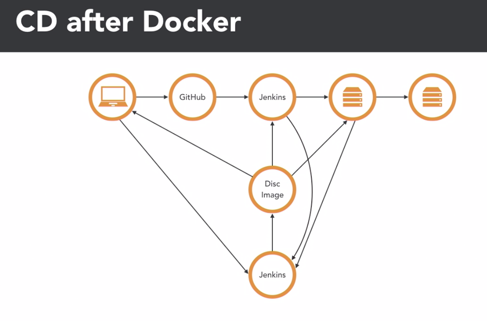
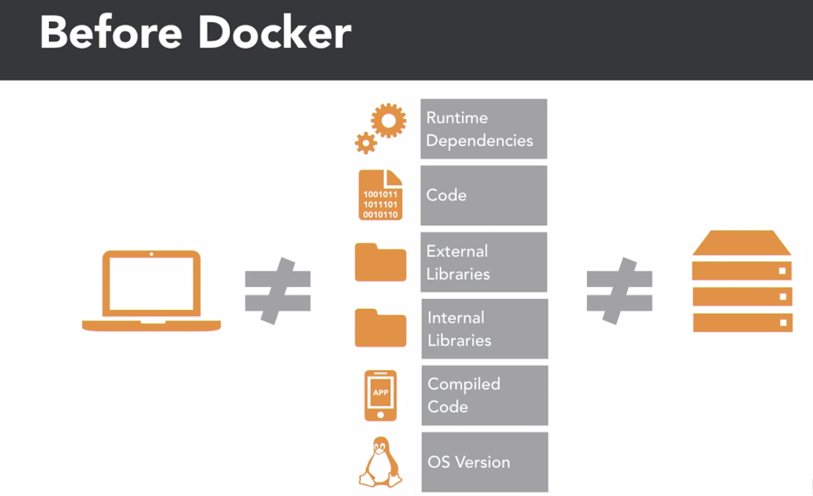
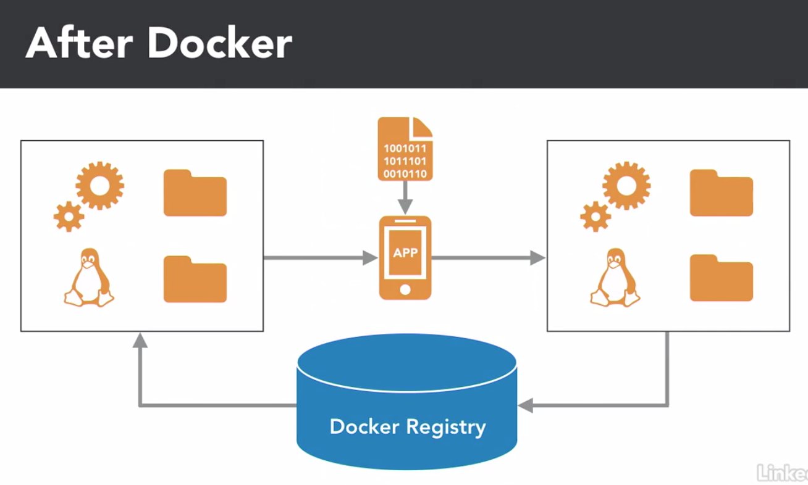
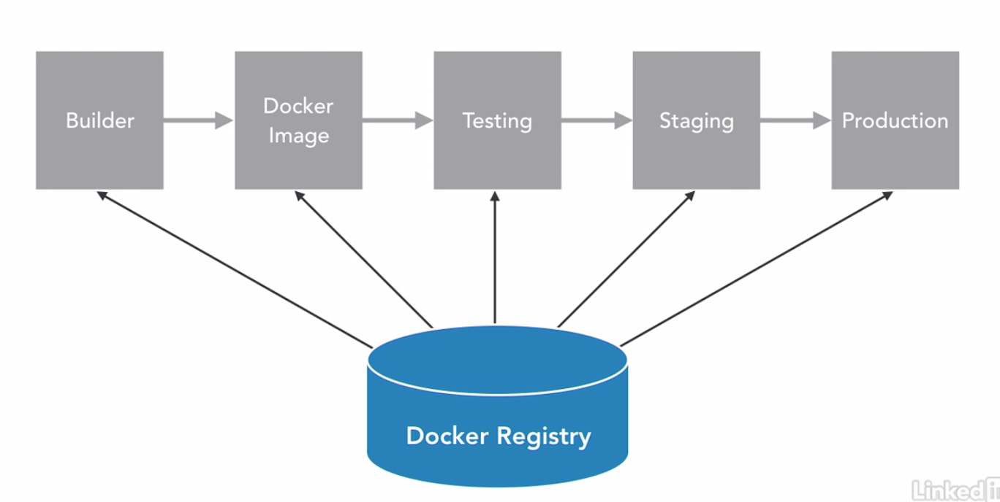

# Continuous delivery with Docker

## 

## architecture

### dependencies and libraries

- Rebuilding a docker can be challenging if it contains dependencies and libraries.
- Store independent copies of all dependencies and libraries used to build Docker images.

### Building docker images

- Use Git hashes as docker image tags.
- Build all docker images from docker file and check them into Git.
- Multiple tags can be used for the same image.

### Deploying docker images

- Automate early and automate often
- Avoid dependencies that tie a container to a specific host (such as docker links or shared volumns)
- Carefully avoid hand-building images
- Compromises are necessary to deploy sucessfully

### CI/CD tools

- Git (source code version control)
- Jenkins (manage deploy process)
- Maven (project structure and dependencies)
- Kubernetes
- Docker registry
- Monitor tools