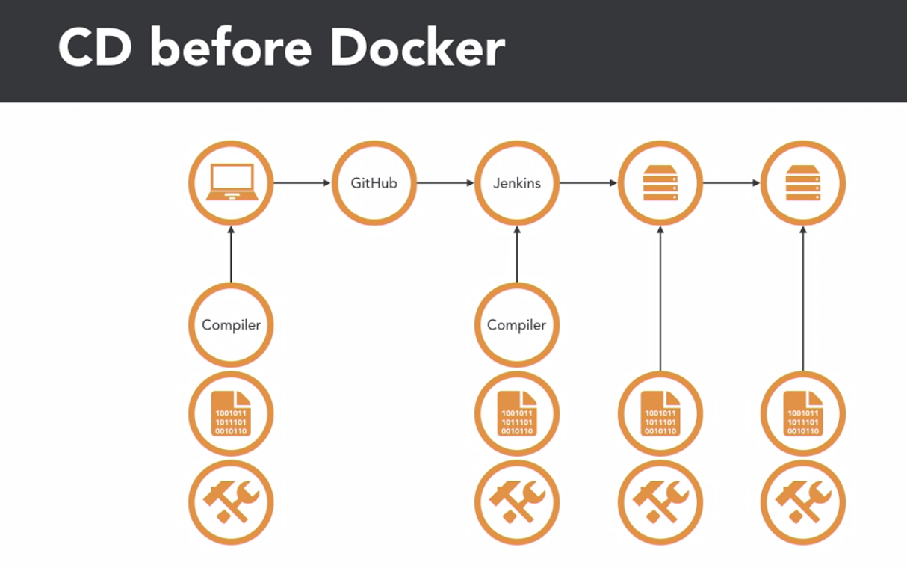

# Continuous delivery with Docker

## 

## architecture

### dependencies and libraries

- Rebuilding a docker can be challenging if it contains dependencies and libraries.
- Store independent copies of all dependencies and libraries used to build Docker images.

### Building docker images

- Use Git hashes as docker image tags.
- Build all docker images from docker file and check them into Git.
- Multiple tags can be used for the same image.

### Deploying docker images

- Automate early and automate often
- Avoid dependencies that tie a container to a specific host (such as docker links or shared volumns)
- Carefully avoid hand-building images
- Compromises are necessary to deploy sucessfully

### CI/CD tools

- Git (source code version control)
- Jenkins (manage deploy process)
- Maven (project structure and dependencies)
- Kubernetes
- Docker registry
- Monitor tools

## Build CI/CD toolbox

### Build docker image for CI

#### Split build and runtime dependencies

- Avoid inclusion of build tools in final images
- Production images should be as small as possible
- Pre-cache common dependencies in build images

#### Build tools for docker

- Are a major source of complexity
- Make re-creation of images challenging
- Steps to run the build might be unknown after the fact
- Dynamically fetching dependencies adds additional complexity

## Deployment

### Blue-Green depolyment

- Create new service before tearing down old ones
- When both new and old service are running, flip traffic to the new service
- Can be done with routing(portable IP address, etc.), DNS, load balance, and other methods
- No overlap
- Very easy to implement

#### Blue-Green depolyment with DNS

#### Blue-Green depolyment with Load Balancers

### Deployment tips

- Be ready to "roll back" from start
- If using automatic load balancing, transition no faster than 2x the balancing sample period
- If using automatic load balancer, give the load balancers time to scale up
- Explicitly prevent inheritance of pathological configurations