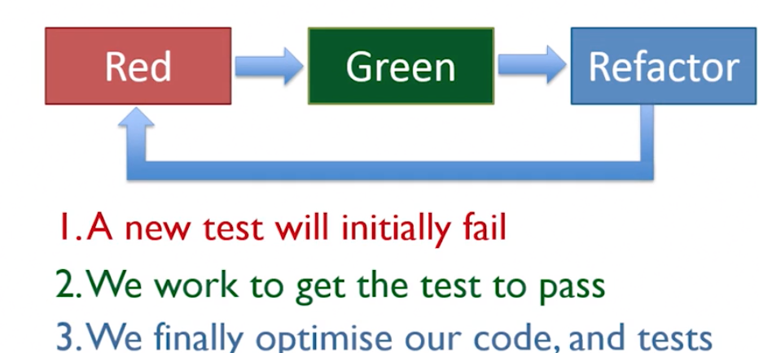

# TDD

## Life cycle
Red(fail) -> Green (pass) -> Refactor  

## Rules of TDD
- Test the expected outcome of an example.
- Don't prejudge design...let your test drive it.
- Write minimum code required to get your tests pass.
- Each test should only validate one single piece of logic.

## What is a "good" or "bad" test?

## Rule of testing

- test one item of functionality only
- test business logic, not methods
- test must be repeatable, and consistent
- test must be thorough

## What tests should I write?
  
- What should the logic be?
- What is the oppsite to that logic?
- Are there any edge cases?
- Are there any error conditions?

## Test with dependencies

- stub
- mock
- 